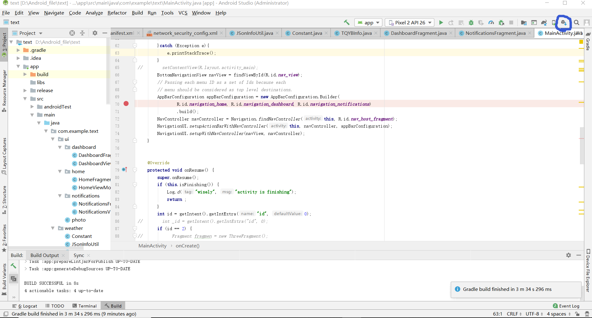

·该文档为华北理工RoboMaster实验室智能衣柜项目android端APP开源文档，仅供RoboMaster实验室内部学习和竞赛使用，欢迎交流讨论。
日期：2020.06.23
作者：解佳朋
联系QQ：460857545
#1.项目工程介绍
##（1）项目基本情况介绍：
&#8195;&#8195;&#8194;项目名称：居家小能手（智能衣柜手机端app）

&#8195;&#8195;&#8194;智能衣柜基本开发情况（截止于2019年ican）：当前智能衣柜项目包含衣柜stm32下位机和手机app端上位机，两者通过蓝牙模块通讯，由app发送取衣或是读取当前温湿度的指令对衣柜进行相应控制，主要功能为衣物分类，自动取衣，温湿度读取和反馈，衣物推荐。

&#8195;&#8195;&#8194;app功能：与下位机通讯、新衣入柜、定位、根据定位地址读取天气、记录喜爱程度，根据当天天气情况推荐适合的衣服。
&#8195;&#8195;&#8194;下位机功能：自动取衣，温湿度读取，蓝牙通讯。
&#8195;&#8195;&#8194;存在的问题：蓝牙无法通讯。
&#8195;&#8195;&#8194;待完善功能：下位机增加衣物清点功能、完善蓝牙通讯、增加温湿度控制功能、扩大放置衣物的空间。app需增加云端账号存储功能，增加家庭组建功能实现数据共享。图片长按大图，未来详细的天气信息反馈，衣物推荐智能化。
##（2）app开发环境：android studio 3.5.0
如下为android studio sdk manager SDK相关版本管理界面截图。

Q：如何进入android sdk manager？
A：寻找android studio右上角sdk manager图标

由当前测试结果可得，当前app适用于android 10到android 7.1.1版本。
#2.主要activity介绍：
主体应用Bottom Navigation Activity框架
##（1）MainActivity继承于AppCompatActivity
&#8195;&#8195;&#8194;项目主体界面，下包含三个子Fragment（可理解为子页面），分别为Home、Navigation和Dashboard均继承于Fragment
###①HomeFragment
&#8195;&#8195;&#8194;该页面为主页面，包含定位，天气，蓝牙连接，衣柜温湿度反馈和当日衣服推荐。
&#8195;&#8195;&#8194;蓝牙连接来自于HC蓝牙串口软件，经过仿写融合提取蓝牙连接部分，可能存在闪退，需留意线程的控制，蓝牙通讯也是socket通讯，主要步骤为搜索设备，断开连接和连接，通过消息返回结果，闪退原因可能为未连接成功但是却发送了消息，或是断开了连接仍在发送消息。
&#8195;&#8195;&#8194;定位来自网络项目，通过gps高精度得到地址，选择低精度时可根据ip地址得到当前所在位置。使用时要注意安卓高版本（可能为8及以上）需动态申请权限，否则会得不到信息。网上资料应该有很多。
&#8195;&#8195;&#8194;天气来自移动工作室吴老师一个练习项目，提取部分内容，使用百度地图api得到某个城市的天气，可得到json对象返回，包含当天信息和未来三天信息，包括天气，温度，pm2.5含量，穿衣指数等。使用时要注意安卓高版本不可使用http协议访问网络，必须使用https协议。该[解决方案](https://blog.csdn.net/u011046184/article/details/90440194?utm_medium=distribute.pc_relevant.none-task-blog-BlogCommendFromMachineLearnPai2-1.nonecase&depth_1-utm_source=distribute.pc_relevant.none-task-blog-BlogCommendFromMachineLearnPai2-1.nonecase)应该可以。连接网络注意不可放入主线程，必须新建一个线程。
&#8195;&#8195;&#8194;温湿度反馈来自于与衣柜下位机进行蓝牙通讯，由下位机控制传感器得到信息，利用蓝牙通讯返回。衣物推荐逻辑当前项目很简单，仅根据温度确定季节，然后显示当前季节的衣物。
##②NavigationFragment
&#8195;&#8195;&#8194;该页面为柜内衣物显示页面，控制衣物取放或是删除衣物以及查看衣物的喜爱程度。
&#8195;&#8195;&#8194;衣物显示使用GridView控件（照片墙）显示衣服入柜所拍摄照片，数据的得到使用一个简易的本地文件存储各项信息，某设定文件夹下所有照片全为当前存储照片。利用文件读写记录衣服的取放和喜爱星级信息，通过操作文件实现信息的记录。
&#8195;&#8195;&#8194;优化方向为云端数据库存储衣物信息，实现不同手机组建家庭组，对同衣柜进行信息共享。
###③DashboardFragment
&#8195;&#8195;&#8194;该页面包含功能为新衣入柜，设计多个按钮，每个按钮代表一个分类空间，根据容量确定按钮数量，根据相应文件夹下的图片内容确定是否有衣服。有衣服显示黑色不可点击，没衣服显示蓝色可点击。点击蓝色没衣服按钮进入拍照页面。
##（2）photo页面继承于AppCompatActivity
&#8195;&#8195;&#8194;对应activity_photo页面布局文件，仅包含一个按钮，点击进入拍照。注意权限的获取，相机的调用和图片的存入，应该不难。
##（3）device_listActivity继承于Activity
&#8195;&#8195;&#8194;该页面为蓝牙连接页面，主要步骤为蓝牙权限的获取，蓝牙的打开，外部设备列表的获取，得到本地蓝牙句柄，关闭查找，连接设备。主要过程仿写于HC蓝牙串口程序。
#3.部分开发问题Q&A
Q:如何入门？
A：主要开发流程：编写布局文件->编写监听->增加功能逻辑->设置画面切换和消息传递。推荐IDE：Android Studio。个人推荐学习该[教程](https://www.runoob.com/w3cnote/android-tutorial-intro.html)，不用全看也可完成基本开发。

Q：如何真机调试？
A：手机进入开发者模式，同城通常为进入关于手机界面，连续点击android版本号即可进入。进入后开启usb调试，使用数据线连接至个人电脑，部分手机需确认赋予计算机调试权限。

Q：如何高效调试代码？
A：合理利用Android Studio debug功能，合理设置断点，分步执行，找到闪退位置，针对位置寻找闪退原因，合理利用Logcat功能查看报错日志。为显示清晰可调节仅显示debug信息。如下图所示：

#4.应注意的问题
1.华为手机对开发有时候并不是十分友好，主要原因可能是安全性更高。华为debug遇到断点不会完全停止，依然会后台运行，解决办法可以选择点击debug白屏时快速按下电源键，锁屏！然后就可以逐个断点停止。
2.注意权限的获取，部分权限除了要在AndroidManifest中声明之外，还要在代码中动态申请。
3.不可在主线程之外的线程之中更新UI，仅主线程具备更新的权限。
4.“消息”在android开发中使用的十分频繁，建议系统学习。主要应用：画面切换，信息传递，分支线程需要更改ui时可选择将更改信息发送到主线程。

&#8195;&#8195;衣柜的app开发当时十分匆忙，功能还十分简陋，代码水准不高，欢迎交流讨论和批评指正。

